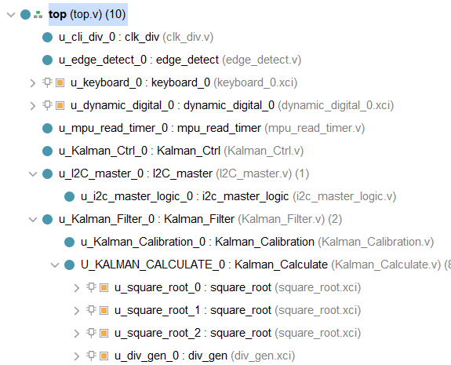
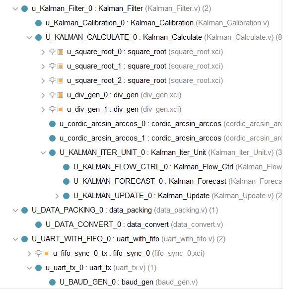

# Pose Detection of MPU6050 Based on FPGA

## 文件夹说明

### algorithm

卡尔曼滤波的C/CPP版本

### docs

说明文档

### ip

使用到的部分ip

### project

完整的工程文件

> vivado版本：2021.02 ML版

### rtl

rtl代码

### tb

rtl的testbench代码

### wave

部分信号的时序图（还没整理好）

### debug

debug过程中用到的脚本和记录的数据，其中`data_gen.py`是用来生成tb测试数据的，`checksum_test.py`是用来验证匿名上位机协议checksum的，`data_process.py`是用于uart数据帧对齐的。


## 使用说明

打开工程后的top层次结构如下：






其中keyboard和dynamic_digital是自己写的ip，分别用于键盘输入，数码管动态显示，工程里也包括了。

> 本项目仅计算了ROLL和PITCH两个角度，没有计算YAW角，YAW默认为0。

### 整体架构说明

[基于FPGA的MPU6050姿态解算（1） | DOA's Blog (floral.github.io)](https://floral.github.io/2022/03/25/基于FPGA的MPU6050姿态解算（1）/)

### top信号说明

```verilog
input				clk_in,		//50m clk in
input				rst_n,

input	[3:0]		col_in,		// 4x4键盘矩阵的列输入

output	[3:0]		row_out,	// 4x4键盘矩阵的行输出

output				scl,		// i2c scl
inout				sda,		// i2c sda

input				rx,			// uart rx, 本工程没用，不连也行
output				tx,			// uart tx

output	[7:0]		seg_out,	// 单个数码管段码输出
output	[5:0]		dig_out		// 不同数码管有效/使能输出
```


### I2C IP修改说明

在原版的IP基础上，增加了`i2c_data_num`、`i2c_ack[6]`信号，前者表示I2C连续写入/读取的数据量（以字节为单位），后者标志主机发送STOP完成。使用的时候只需在给`i2c_config`赋值的同时给`i2c_data_num`赋值即可。

完成指定数据量的写入/读取之后，`i2c_ack[6]`信号会被拉高。


### Kalman Ctrl

该模块是一个有四个状态的状态机：`WAIT`、`CONFIG`、`CALIBRATE`、`CALCULATE`。

控制整个流程的不同状态切换。

在`CALIBRATE`状态下，I2C是连续读取的，即`I2C_Config`不切换；在`CALCULATE`状态下，I2C的读取频率是由`mpu_read_timer`决定的，默认频率是800Hz（是由UART 115200速率经过计算后的最合适频率），每出现一次`timer_tick`，`I2C_Config`才切换为`I2C_Continuous_Read_Byte`状态，`i2c_ack_6_pos_in`被拉高后则进入`WAIT`状态。


### data packing

本项目使用的上位机是<匿名上位机>，所以协议使用的也是该上位机的协议。

> 上位机下载地址： [匿名科创\] (anotc.com)](http://anotc.com/wiki/匿名产品资料/资料下载链接汇总)
>
> [匿名上位机（V7）基于串口的简单使用_Silent Knight的博客-CSDN博客_匿名上位机v7](https://blog.csdn.net/weixin_46185705/article/details/113359120)


### cordic_arcsin_arccos

注意该模块中有一个需要读入的atan数据文件`atan.data`在`project/vivado/Pose_Detection_With_Kalman_Filter/C_model/`下。


### UART with fifo

uart速率默认为115200

